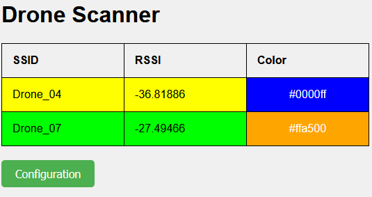
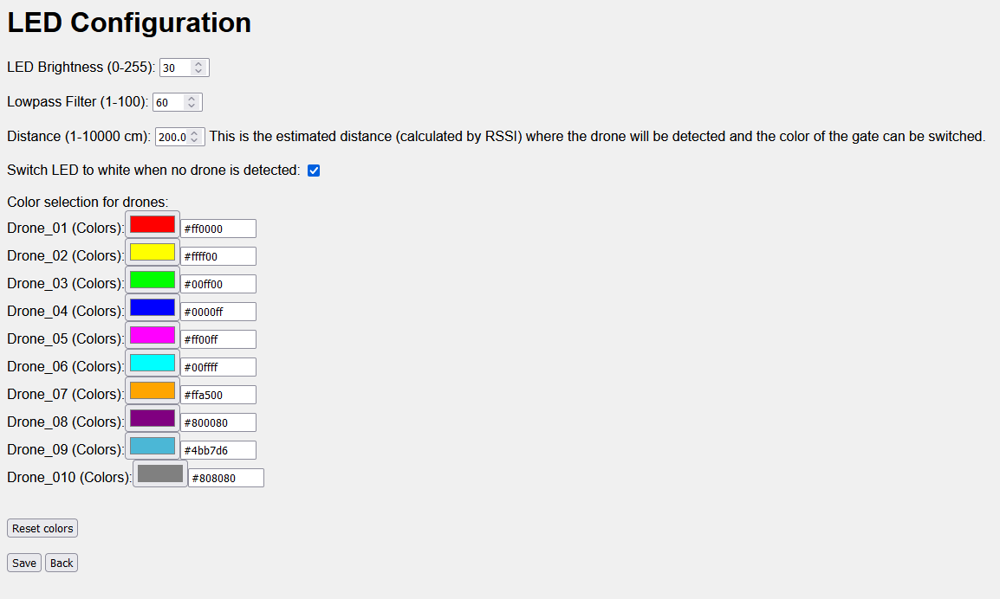
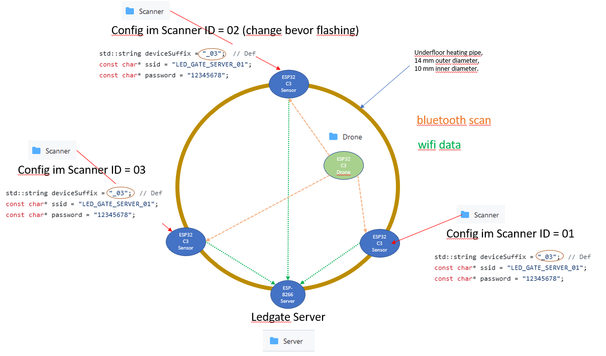

# LED Connection:
* LEDs can be connected to the FPV Drone Gate via the D4 pin (GPIO2).

# Hotspot Scan:
* The gate scans for other hotspots with names like Drone_XX, up to a maximum of 10 drones.

# ESP8266 in Gate:
* The ESP can be accessed at IP 192.168.4.1 after connecting to the AP. AP: DRONE_GATE_01, PW: 12345678 --> if there are multiple gates, the SSID counter must be adjusted, which can be found at the top of the code.

# ESP8266 in Drones:
* Each drone can be equipped with an ESP8266. This will be scanned without establishing a connection to speed up the process. Only a power connection for the ESP in the drone is required after flashing the software.
* The ESP can be accessed at IP 192.168.4.1 after connecting to the AP. AP: DRONE_XX, PW: 12345678

# LED Color Selection:
* An individual LED color can be selected for each drone. Based on the RSSI signal, the LED color of the gate is set to the color of the drone with the lowest RSSI value.

# Additional Configurations:
* Some additional basic configurations are possible to optimize the user experience.

# Gate Setup:
* Underfloor heating pipe with LED strip width 5 mm WS2812B LEDs, 60 LEDs per meter
* 3D printed holder
* ESP-Wroom-02 with 18650 cell

# Idea for Improving Positioning Accuracy with Bluetooth: 
* Currently, the issue is the transmission speed between the three ESP32-C3 devices and the main Esp8266, if there is more then one esp32 c3 connected to the Server. If only one seatellit is connected the speed is very well. 
 
Testversion:
https://github.com/druckgott/FPV_drone_gate/tree/main/bluetooth_scan_test
